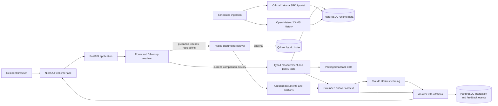

# Napas Jakarta

> A bilingual, citation-grounded air-quality companion for Jakarta residents.

**Try the deployed app:** [web-production-e07b9.up.railway.app](https://web-production-e07b9.up.railway.app)<br>
**API health:** [web-production-e07b9.up.railway.app/health](https://web-production-e07b9.up.railway.app/health)<br>
**Monitoring:** [web-production-e07b9.up.railway.app/monitoring](https://web-production-e07b9.up.railway.app/monitoring)

Napas Jakarta helps people turn an air-quality reading into an informed next step. It combines current Jakarta station observations, a separately labelled city-level historical series, and curated official regulations and public-health guidance. Ask in English or Bahasa Indonesia; answers identify their sources, show observation time where relevant, and avoid treating general guidance as medical diagnosis or legal advice.

## Why Jakarta, and why this problem?

Air quality is a practical, time-sensitive problem in Jakarta. A resident deciding whether to commute, exercise, open windows, or take extra precautions needs more than a bare index: they need the station, pollutant, time of observation, and plain-language context. They may also need to distinguish a current station reading from historical city context, an Indonesian rule, or non-binding health guidance.

A general-purpose chatbot can easily blur those distinctions. Values can be stale, a reading at one station is not the whole city, and a policy proposal must not be presented as an enacted rule. Napas Jakarta was built to make those boundaries visible rather than hiding them behind a fluent answer.

## What you can do

| Area | What it is for |
| --- | --- |
| **Ask** | Ask grounded questions about current conditions, causes, protections, regulations, or evidence. Responses stream into the conversation and show their sources. |
| **Live map** | Explore the latest available station readings by location and pollutant. Select a marker for station details and freshness information. |
| **Overview** | Compare the latest station snapshot with category, district, and top-station summaries. |
| **Trends** | Inspect separately labelled Jakarta city PM2.5/PM10 history. It is contextual city-level data, not an official SPKU station time series. |
| **Monitoring** | View aggregate service health: request volume, latency, routes, retrieval modes, citation rate, feedback, and token/cost estimates. |

### Questions to try

Current observations:

- `What is the latest PM2.5 reading in Jakarta Pusat, and when was it observed?`
- `Bagaimana kualitas udara terbaru di Jakarta Selatan?`
- `Compare Jakarta Timur and Jakarta Barat.`

History and context:

- `How has city-level PM2.5 changed over the available history?`
- `What does an ISPU value of 125 mean?`
- `What are the main sources of air pollution in Jakarta?`

Rules, protection, and evidence:

- `Which air-quality regulations are currently in force in Jakarta?`
- `Is ERP already an enacted rule?`
- `What can I do on a polluted day if I need to be outdoors?`
- `Does living on a high floor always reduce pollution exposure?`

Follow-ups work in the same chat:

1. `What is the current air quality in Jakarta Pusat?`
2. `How does that compare with the north?`
3. `Would outdoor exercise there be sensible?`

For an emergency or severe/persistent breathing symptoms, seek urgent or professional medical care. The app provides educational air-quality information and does not diagnose individuals.

## How an answer is produced



The browser and API are one ASGI deployment: NiceGUI supplies the interactive interface while FastAPI exposes the same domain functions as HTTP endpoints. The router first recognises questions that need deterministic structured data, such as a latest station reading or location comparison. Those routes use typed Python tools instead of asking a language model to calculate values or query a database.

Questions about sources, public-health guidance, regulations, implementation status, and exposure evidence use document retrieval. Selected passages and structured results form the answer context. When Claude is configured, the answer is streamed through Anthropic's Messages API; if a provider is unavailable, the app retains a cited deterministic fallback. Citation validation checks that cited source identifiers came from retrieved evidence.

The conversation keeps a bounded recent history and resolves common Jakarta district references in follow-up turns. It does not send an unbounded transcript to the provider.

## Data layers and provenance

Napas Jakarta intentionally does not merge unlike data into a single implied truth.

| Layer | What it contains | How it should be read |
| --- | --- | --- |
| **Official current observations** | Station location, pollutant, ISPU, concentration, and observation timestamp from the [Udara Jakarta SPKU portal](https://udara.jakarta.go.id/lokasi-spku). | A station observation describes that location and time, not every neighbourhood or a forecast. The app shows freshness and source mode. |
| **Historical city context** | Daily Jakarta city PM2.5 and PM10 context retained from a Zenodo dataset and refreshed from the [Open-Meteo air-quality API](https://open-meteo.com/en/docs/air-quality-api), which uses CAMS Global data. | Explicitly labelled city-level/modelled context. It is not official SPKU station history and should not be substituted for it. |
| **Curated documentary evidence** | Official DKI Jakarta material, Indonesian regulation records, court/policy records, and public-health guidance from organisations such as WHO and EPA. | Each source preserves publisher, date/status where available, geographic scope, and legal or guidance status. Citations link back to the source record. |

The scheduled ingestion service targets an hourly official-station refresh and a daily historical refresh. Runtime data is stored in PostgreSQL; packaged data remains only as a transparent fallback if the runtime source is unavailable. The [data contract](docs/data-contract.md), [source and citation notes](docs/corpus-and-citations.md), and [limitations](docs/limitations.md) provide the fuller provenance record.

## Run locally

### Prerequisites

- Python 3.11–3.13
- [uv](https://docs.astral.sh/uv/)
- An Anthropic API key for streamed Claude answers (optional for deterministic/cited fallback behaviour)

```bash
git clone https://github.com/aasnani/napas-jakarta.git
cd napas-jakarta
cp .env.example .env
```

Set these values in `.env` for Claude Haiku:

```dotenv
LLM_PROVIDER=anthropic
ANTHROPIC_API_KEY=your-key-here
LLM_MODEL=claude-haiku-4-5-20251001
```

Install the locked development environment and start the combined NiceGUI/FastAPI server:

```bash
uv sync --frozen --extra dev
uv run uvicorn app.web:app --host 0.0.0.0 --port 8502
```

Open <http://localhost:8502>. The health endpoint is at <http://localhost:8502/health>. `make setup`, `make run`, and `make test` are equivalent shortcuts for the usual local workflow.

To fetch the official portal snapshot locally, set `SOURCE_DATA_URL=https://udara.jakarta.go.id/` (or a permitted official CSV/JSON export) and run:

```bash
uv run python -m ingestion.flow
```

This validates station, timestamp, ISPU, and coordinate fields before publishing normalized data. Use `uv run python -m ingestion.historical` or `make refresh-history` to refresh historical city context. See [the data contract](docs/data-contract.md) before changing a source URL.

### Docker Compose

Compose starts the web application, standalone API, PostgreSQL, Qdrant, Grafana, and one-shot ingestion/index jobs:

```bash
cp .env.example .env
# add ANTHROPIC_API_KEY to .env if you want Claude streaming
docker compose up --build -d
make smoke
```

Local addresses after startup:

- App and combined API: <http://localhost:8502>
- Standalone API: <http://localhost:8000>
- Grafana: <http://localhost:3000>
- Qdrant: <http://localhost:6333>

Stop the stack with `make down`. The Compose file uses PostgreSQL automatically and runs ingestion before the app starts. To build the optional hybrid Qdrant index outside Compose, run `make index`.

### Configuration

| Variable | Required | Purpose |
| --- | --- | --- |
| `LLM_PROVIDER` | No | `anthropic` by default; selects the answer provider path. |
| `ANTHROPIC_API_KEY` | For Claude | API key used server-side for streamed Claude answers. Never commit it. |
| `ANTHROPIC_BASE_URL` | No | Anthropic API base URL; defaults to the public API. |
| `LLM_MODEL` | No | Claude model name; defaults to `claude-haiku-4-5-20251001`. |
| `DATA_DIR` | No | Data root; defaults to `data`. |
| `SOURCE_DATA_URL` | No | Official portal page or permitted official CSV/JSON export. Blank keeps packaged fallback data. |
| `POSTGRES_DSN` | No locally; used in deployment | PostgreSQL connection for durable measurements, history, feedback, and telemetry. |
| `RETRIEVAL_MODE` | No | Retrieval default; `hybrid` is the selected local mode. |
| `REWRITE_MODE` | No | `rules` enables deterministic Jakarta/district query normalisation. |
| `QDRANT_URL` | No | Enables the optional Qdrant hybrid index when available. |
| `MONITORING_DB` | No | Local JSONL telemetry fallback when PostgreSQL is unavailable. |
| `NICEGUI_STORAGE_SECRET` | In production | Secret for NiceGUI session storage. Set a long random value outside the repository. |

The committed [.env.example](.env.example) is the canonical complete template. OpenAI-compatible variables remain supported for that provider path, but the deployed service uses Anthropic.

## HTTP API

The web deployment also serves FastAPI endpoints. These examples use a local standalone API; replace the base URL with the deployed URL when appropriate.

```bash
# Service and source state
curl http://localhost:8000/health
curl http://localhost:8000/sources

# Grounded answer
curl -X POST http://localhost:8000/ask \
  -H 'content-type: application/json' \
  -d '{"question":"What is the latest reading in Jakarta Pusat?", "language":"English"}'

# Latest structured observation
curl 'http://localhost:8000/measurements/latest?location=Jakarta%20Pusat&pollutant=PM2.5'

# Aggregate-only monitoring data
curl 'http://localhost:8000/monitoring/summary?days=30'
```

Other useful endpoints include `POST /measurements/compare`, `POST /measurements/history`, `POST /measurements/unhealthy-days`, `POST /measurements/standard`, `GET /policies/status`, `GET /policies/timeline`, and `POST /feedback`. Request models are defined in [app/api.py](app/api.py).

## Evaluation and quality checks

Evaluation artefacts are committed so results can be inspected and regenerated. Retrieval is evaluated on 30 bilingual questions with completed human review of relevant chunk IDs. The benchmark ranks parent documents at five results, while relevance is recorded at chunk level.

| Retrieval mode | Question hit@5 | Chunk recall@5 | MRR@5 | nDCG@5 | p50 latency |
| --- | ---: | ---: | ---: | ---: | ---: |
| BM25 | 0.6000 | 0.4912 | 0.4594 | 0.4326 | 6.2206 ms |
| Dense | 0.6333 | 0.4912 | 0.4833 | 0.4587 | 6.1378 ms |
| **Hybrid (selected)** | **0.6667** | **0.5789** | 0.4694 | **0.4856** | 6.1650 ms |
| Hybrid + rerank | 0.6333 | 0.5439 | **0.4956** | 0.4806 | 6.7447 ms |

The selection order is chunk recall, question hit rate, MRR, nDCG, then lower p50 latency. Results are in [retrieval_gold_review_30.json](evaluation/results/retrieval_gold_review_30.json); reviewed rows are in [gold_review_30_final.jsonl](evaluation/gold_review_30_final.jsonl).

For provider generation, two ten-case Claude Haiku prompt arms were run against the same representative intent groups. The selected **strict** arm recorded 1.0 for relevance, citation correctness, citation completeness, numeric consistency, and safety, and 0.9 for the language heuristic. The helpful arm recorded 0.7 citation correctness and 0.6 citation completeness. These are bounded provider checks, not a claim of broad real-world performance; see [generation_provider_claude_smoke.json](evaluation/results/generation_provider_claude_smoke.json).

Additional reproducible checks cover citation resolvability, completeness, and locator accuracy; 29 two- and three-turn conversation cases; deterministic tool arguments, numeric consistency, freshness, missing data, and rejected unsupported calculations; query rewriting, chunking choices, ingestion idempotency, and safety/out-of-domain abstention.

```bash
make test
make eval
PYTHONPATH=. uv run python evaluation/eval_gold_review_30_retrieval.py
make validate-sources
uv run ruff check .
```

`make eval` intentionally uses local/offline checks by default. A provider evaluation consumes API calls only when explicitly configured; see [docs/evaluation.md](docs/evaluation.md) for the method, scope, and rerun controls.

## Monitoring, feedback, and privacy

The in-app [Monitoring page](https://web-production-e07b9.up.railway.app/monitoring) reads aggregate service telemetry from PostgreSQL and falls back to local JSONL during development or a database outage. It shows traffic, latency percentiles, answer routes, retrieval modes, citation-grounded rate, thumbs-up/down feedback, conversation depth, and estimated usage/cost.

The dashboard deliberately does not retrieve or display question text, rewritten queries, or feedback comments. Interaction logging uses a bounded anonymous session identifier rather than an IP address or personal profile. Feedback is attached to an interaction ID so aggregate quality signals can be analysed without exposing a resident's conversation in the dashboard. Do not enter sensitive health or personal information into the app.

## Deployment

The live service runs on Railway as three managed components:

- **Web:** NiceGUI/FastAPI ASGI application at [web-production-e07b9.up.railway.app](https://web-production-e07b9.up.railway.app)
- **PostgreSQL:** durable runtime observations, city-history context, interactions, and feedback
- **Ingestion cron:** an hourly official-source refresh target, with the historical refresh branch scheduled daily

The Railway deployment uses the same [Dockerfile](Dockerfile) and [railway.toml](railway.toml) as this repository. The deployment guide covers variables, scheduled ingestion, WebSocket verification, source fallback, and teardown: [docs/deployment-railway.md](docs/deployment-railway.md).

## Repository guide

```text
app/            NiceGUI pages, FastAPI API, RAG orchestration, routing, tools, and providers
data/           Source manifest, curated documents, processed measurements, historical context
ingestion/      Validation, official-source connector, historical refresh, corpus/index builders
evaluation/     Human-reviewed retrieval set, evaluators, and reproducible result artefacts
monitoring/     Privacy-preserving interaction logging and aggregate analytics
grafana/        Local Grafana dashboard provisioning
tests/          Unit, contract, provenance, UI, and artefact tests
docs/           Architecture, data, evaluation, deployment, and limitation notes
```

## Responsible use and known limits

- Air quality can change quickly. Check the observation time, station, pollutant, and source mode before acting; a fallback snapshot is not live data.
- Station observations are location-specific. Do not infer a citywide condition, neighbourhood exposure, indoor exposure, or a forecast from one value.
- Historical charts are separately labelled city-level modelled context, not official station history.
- Health guidance is educational. The app does not diagnose, triage, or replace a clinician; seek professional care for concerning symptoms.
- Regulations and policy status are documented as of their cited source/status dates. Verify current obligations with the responsible authority or qualified adviser.
- Retrieval is useful but imperfect, particularly across languages and multi-source questions. Use the displayed citations to inspect underlying evidence.

For deeper implementation detail, start with [architecture](docs/architecture.md), [evaluation](docs/evaluation.md), [data contract](docs/data-contract.md), and [limitations](docs/limitations.md).
