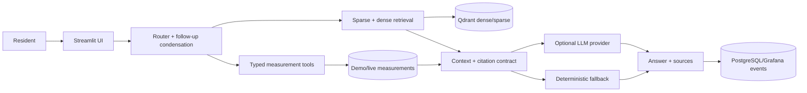

# Napas Jakarta

Napas Jakarta is a starter implementation of a bilingual, citation-grounded
Jakarta air-quality assistant for the DataTalksClub LLM Zoomcamp project.

This repository contains a runnable bilingual corpus, deterministic retrieval
baseline, FastAPI service, NiceGUI/Quasar UI, Streamlit fallback, Prefect-compatible ingestion flow,
and PostgreSQL/Grafana monitoring topology. The measurement snapshot is
explicitly labelled and must not be described as a historical time series.

## Run locally

    cd napas-jakarta
    make test
    make run

The primary UI is served at <http://localhost:8502> by the combined
NiceGUI/FastAPI ASGI app. `make run-streamlit` remains available as a rollback
surface on port 8501 while comparing the two presentations.

Or run the full local service topology:

    make up

If Docker is unavailable, Podman can build and run the same image:

    podman build -t napas-jakarta:local .

The pinned image has been verified locally: its Prefect ingestion command
completes, and a running API returns successfully from `/health` and `/ask`.
The image also exposes the deterministic `/measurements/standard` comparison
endpoint used by the structured-tool checks.

The Compose topology exposes the NiceGUI UI and FastAPI API on port 8502, the FastAPI API on
port 8000, and Grafana on port 3000. The current demo uses JSONL monitoring
unless POSTGRES_DSN is configured; Compose configures PostgreSQL automatically.
Run `make smoke` after startup to verify all three HTTP health endpoints.

The committed demo uses a small snapshot in data/demo/measurements.csv. It
must not be presented as live data. When SOURCE_DATA_URL is configured, the
ingestion flow writes official measurements and persisted station coordinates
to data/processed/.
Without an LLM key, the app still answers common ISPU and WHO terminology
questions deterministically from the cited demo corpus; adding `OPENAI_API_KEY`
enables the provider-backed generation path.
For Claude Haiku, copy `.env.example` to `.env` and set
`LLM_PROVIDER=anthropic`, `ANTHROPIC_API_KEY=your-key`, and
`LLM_MODEL=claude-haiku-4-5-20251001`; `.env` is Git-ignored.
The local Claude smoke evaluation is recorded at
`evaluation/results/generation_provider_claude_smoke.json`.
The committed generation artifact compares two offline prompt arms and records
the winner; configure an API key to replace that fallback comparison with real
model outputs.

Temporary public verification URL (Cloudflare Quick Tunnel, no account):
<https://dicke-completion-comic-principles.trycloudflare.com>
(verified unauthenticated with HTTP 200 on 2026-09-07 Asia/Jakarta). This URL
is ephemeral and is suitable for review only; a named cloud deployment is still
required for durable hosting.

To ingest an official Jakarta CSV or JSON export, set `SOURCE_DATA_URL` in
`.env` and run `python -m ingestion.flow`. The connector validates required
station, timestamp, ISPU, and location fields before writing the normalized
file to `data/processed/measurements.csv`; the API and UI consume that file on
the next start. The Satu Data Jakarta search API is
documented in `docs/data-contract.md`; select a permitted export URL from its
dataset metadata rather than scraping the portal.

## Example questions

Try these in the local UI or with `POST /ask`:

- `What does an ISPU value of 125 mean?` — explains the unitless Indonesian
  index and cites the ISPU methodology.
- `What is the current air quality in Jakarta Pusat?` — uses the deterministic
  measurement path and includes station, pollutant, timestamp, unit, and
  freshness.
- `Can you diagnose my breathing problem?` — refuses diagnosis and points to
  appropriate professional care.

The first and third examples work without a paid model key; the second is
explicitly labeled demo or live according to the loaded source.

## Initial architecture

Structured measurements are loaded separately from documents. In Compose,
validated measurements are upserted into PostgreSQL and the API/UI read that
typed repository; offline runs fall back to the committed CSV snapshot.
Measurement questions use deterministic summaries, while policy and health questions use
document retrieval. Retrieval exposes BM25, dense character-vector baseline,
hybrid RRF, and hybrid reranking modes so the evaluation can select the
production configuration. The FastAPI API provides /health, /ask, and
/feedback endpoints.
Current, historical, comparison, and unhealthy-day questions in the chat path
also carry deterministic tool results into the grounded answer context; the
LLM is not asked to perform those calculations.
Peak-station questions use the same typed measurement path and report the
station, pollutant, value, timestamp, and source.
The deterministic tool endpoints `/measurements/latest`,
`/measurements/compare`, `/measurements/history`, and
`/measurements/standard` are also available for structured-data checks.
`/measurements/unhealthy-days` exposes the deterministic ISPU day-count tool.
The Streamlit UI uses wide Ask, Live map, Current overview, and Trends tabs.
The map uses persisted station coordinates and a selectable PyDeck view. The
overview uses snapshot-appropriate category, district, distribution, and
top-station charts. Trend charts remain explicitly disabled until multiple
observation timestamps are accumulated. Claude receives a bounded recent chat
window so follow-up questions work without sending an unbounded transcript.

The retrieval experiment writes machine-readable results and a reviewer-ready
comparison chart at
[`evaluation/results/retrieval_plot.png`](evaluation/results/retrieval_plot.png).

## Data sources

See data/sources.yaml and docs/data-contract.md. The intended primary sources are the official Udara Jakarta
portal, Satu Data Jakarta, Indonesian regulations, and WHO guidance.

## Evaluation evidence

The current committed retrieval result uses the expanded-v1 corpus and a
150-question stratified seed set, with every question and relevance label
marked as pending human review. On the current expanded offline artifact,
hybrid leads on MRR and nDCG and is the shipped default; hybrid-rerank has the
highest hit rate but lower ranking metrics and higher latency.
The conversation artifact covers 29 two- and three-turn follow-up cases with
100% offline resolution and route accuracy. Trends also use the separately
labelled Zenodo/Open-Meteo city series in
`data/processed/historical_city_air_quality.csv`; official station readings
remain a distinct data layer.
Before treating the system as production-ready, complete that review, add
provider-backed generation and groundedness evaluation, attach monitoring
screenshots, and replace the temporary tunnel with a durable deployment URL. No
current-data claim should be made until its timestamp and source are displayed.
The committed ingestion artifact records a two-run idempotency check and
validation counts at `evaluation/results/ingestion_results.json`.

To exercise the optional Qdrant index locally, start the Compose Qdrant service
and run `make index` (or `python -m ingestion.build_index --hybrid` for dense
plus sparse collections). The application-level retrieval benchmark remains
dependency-light and is reproducible without Qdrant.
Compose runs a one-shot `index` service after ingestion to populate Qdrant's
dense and sparse collections before the app/API start.

See [docs/architecture.md](docs/architecture.md), [docs/evaluation.md](docs/evaluation.md),
 [docs/ground-truth-review.md](docs/ground-truth-review.md),
 [docs/deployment.md](docs/deployment.md), [docs/deployment-railway.md](docs/deployment-railway.md),
 and [docs/limitations.md](docs/limitations.md)
for the implementation evidence, responsible-use boundaries,
and the remaining production/deployment checklist.

### Verification status

| Area | Verified locally | External step remaining |
|---|---|---|
| API/UI, citations, safety, bilingual flow | Yes | Durable named deployment (temporary URL verified) |
| Retrieval, chunking, Qdrant hybrid path | Yes | Multilingual model download for production index |
| Prefect ingestion, validation, monitoring | Yes | Scheduled cloud refresh and populated managed dashboard |
| Generation evaluation | Offline contract harness | API-key-backed models and calibrated judge |
